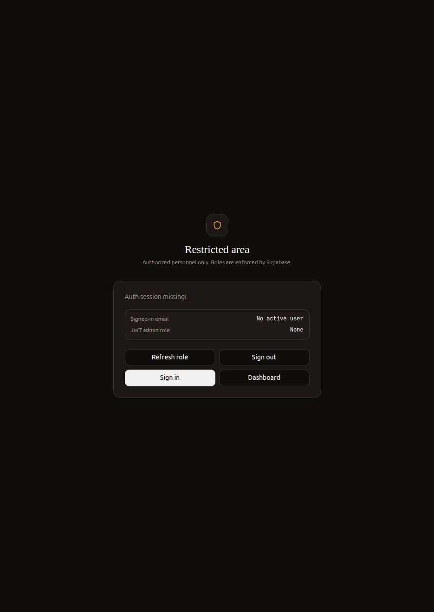
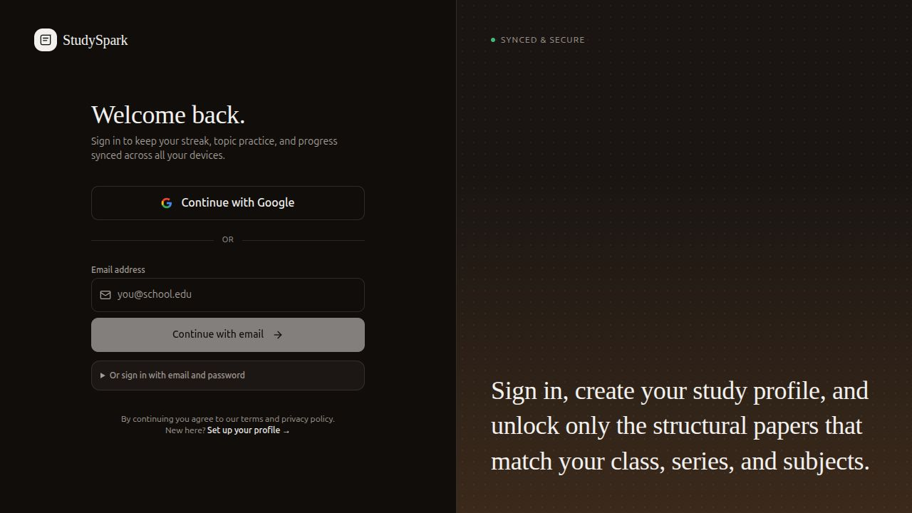

# Issue 25 UI Test Notes

Date: 2026-09-21
Branch: `codex/issue-25-admin-content-workflow`

## What Was Verified

- `npm run build` passes after the admin workflow changes.
- Local app starts on the project-required port `8080`.
- Admin content routes remain protected when there is no Supabase admin session.
- Learner app routes redirect to sign-in when there is no active learner session.
- The admin workflow code now compiles against the branch-local reference data constants and does not depend on separate uncommitted bilingual/profile changes.

## Screenshots

## Auth-Gated Test Limitation

The full draft → preview → review → publish → learner report → admin resolve flow is protected by Supabase Auth and admin JWT role checks. The local in-app browser session used for this test did not have an active learner or admin session, so the protected workflow could not be clicked end-to-end in the browser.

To complete the final interactive pass, sign in locally with:

- a learner account for `/dashboard` and `/course/:documentId`
- an admin or super-admin account for `/control-panel-9k3x/courses`, `/control-panel-9k3x/questions`, and `/control-panel-9k3x/cheatsheets`

Then verify:

- Admin can open the upload form.
- Admin can fill metadata, preview learner view, and save draft/review/published states.
- Publish is blocked until required metadata, permission status, review status, and preview are complete.
- Learner can open a published document and submit a content issue report.
- Admin can see the report and mark it reviewing/resolved.
